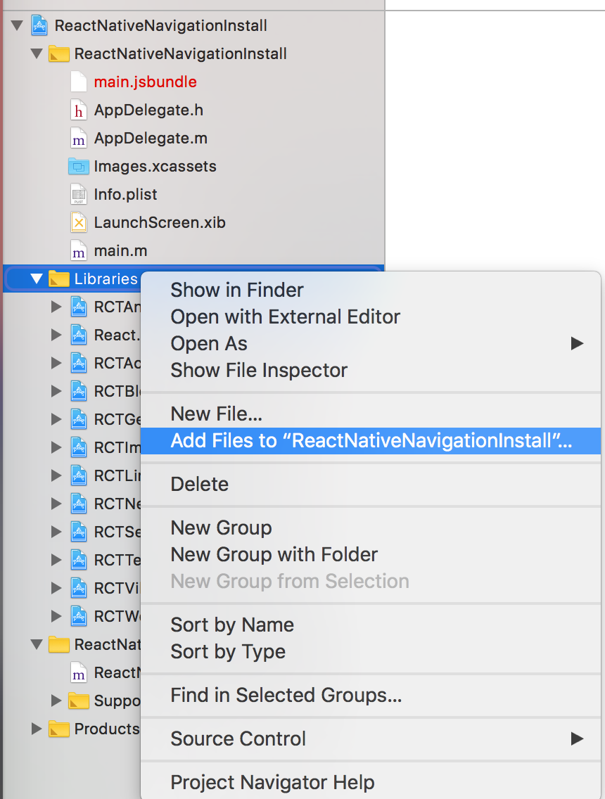
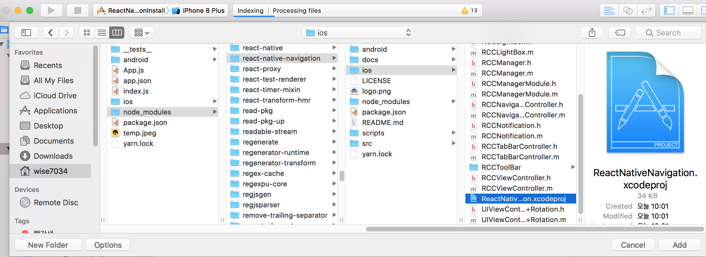
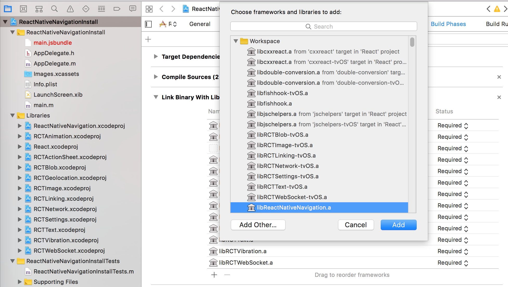
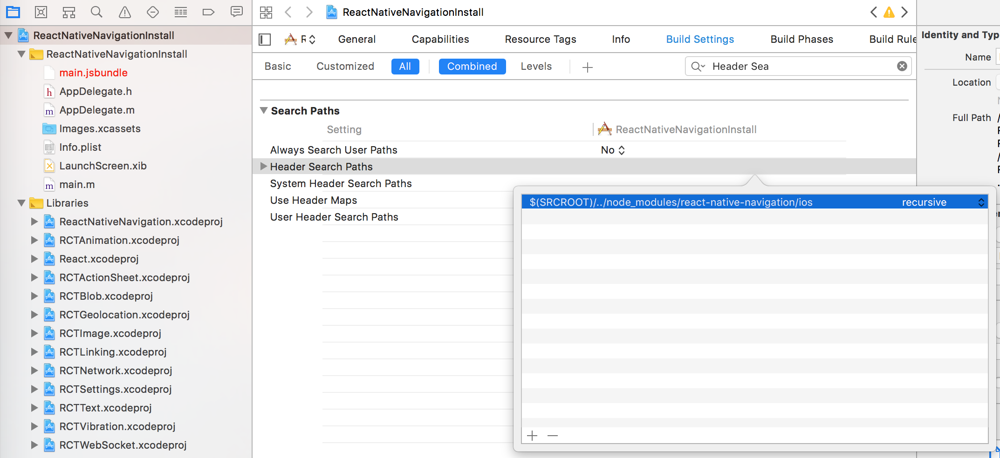
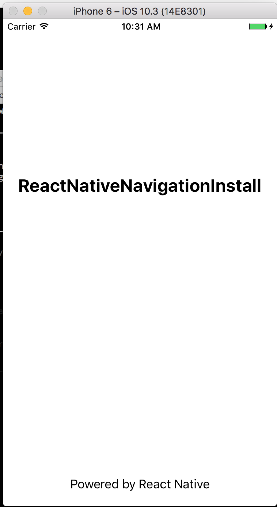
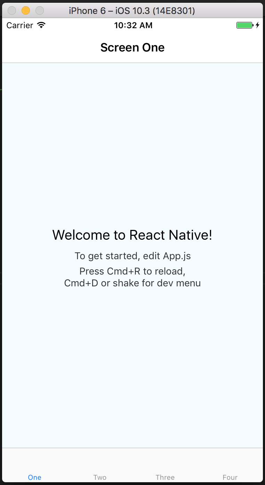
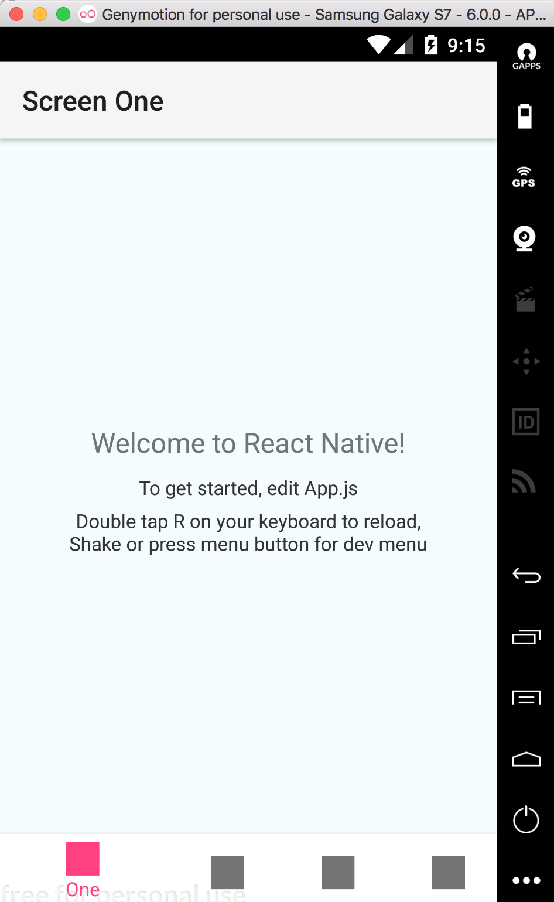
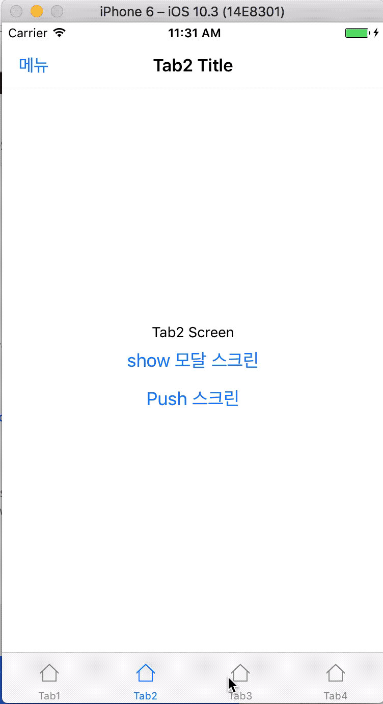

# ReactNative react-native-navigation Practice

나는 주로 react-navigation을 사용하고 있고, 관련 내용은 [ReactNative react-navigation Practice](https://github.com/kjk7034/RNNavigationPractice)로 샘플 코드를 정리한 적이 있다.

그러다가 [react-native의 지옥 1호 : navigation](https://jsdev.kr/t/react-native-1-navigation/2617) 글도 읽게 되었고 비슷한 시기에 [react.native.community](https://www.facebook.com/groups/react.native.community/)에 다음과 같은 투표 결과도 보게 되었다.

현재까지 내가 본 투표 결과는 React native navigation이 211명으로 React Navigation 52명, React-native-router-flex 50명보다 많았다.


내 생각보다 많은 개발자들이 React native navigation을 사용하고 있었다.

현재 기준으로 Star 수는 react-navigation가 7,454명, react-native-navigation이 4,905명으로 react-navigation이 많았기 때문이다.

## 프로젝트 설치 및 환경 설정

```
react-native init ReactNativeNavigation
```

처음에는 프로젝트 이름을 **ReactNativeNavigation**이라고 했는데, 안드로이드 환경 설정 시 import com.reactnativenavigation 을 불러올 때 동일한 이름이 있어서 문제가 발생한다. 그래서 이름을 ReactNativeNavigationInstall으로 변경하게 되었다.

### iOS Installation

```
cd ReactNativeNavigationInstall
yarn add react-native-navigation@latest
```

In Xcode, in Project Navigator (left pane), right-click on the <span style="color:orange;">Libraries</span> > <span style="color:orange;">Add files to [project name]</span>. Add <span style="color:orange;">./node_modules/react-native-navigation/ios/ReactNativeNavigation.xcodeproj</span>




In Xcode, in Project Navigator (left pane), click on your project (top) and select the <span style="color:orange;">Build Phases</span> tab (right pane). In the <span style="color:orange;">Link Binary With Libraries</span> section add <span style="color:orange;">libReactNativeNavigation.a</span>



In Xcode, in Project Navigator (left pane), click on your project (top) and select the <span style="color:orange;">Build Settings</span> tab (right pane). In the <span style="color:orange;">Header Search Paths</span> section add <span style="color:orange;">$(SRCROOT)/../node_modules/react-native-navigation/ios</span>. Make sure on the right to mark this new path <span style="color:orange;">recursive</span>



In Xcode, under your project files, modify <span style="color:orange;">AppDelegate.m</span>

[수정한 AppDelegate.m 파일](https://github.com/kjk7034/ReactNativeNavigation/blob/master/ReactNativeNavigationInstall/ios/ReactNativeNavigationInstall/AppDelegate.m)

결과 확인하기

```
react-native run-ios
```



앱 실행 화면에서 멈춰있다면, 당황하지 말고 잘 설정되었다.

### Android Installation

```
cd ReactNativeNavigationInstall
yarn add react-native-navigation@latest
```
(iOS에서 했으면 패스...)

Add the following in <span style="color:orange;">android/settings.gradle</span> ([참고파일](https://github.com/kjk7034/ReactNativeNavigation/blob/master/ReactNativeNavigationInstall/android/settings.gradle))

```
include ':react-native-navigation'
project(':react-native-navigation').projectDir = new File(rootProject.projectDir, '../node_modules/react-native-navigation/android/app/')
```

Update project dependencies in <span style="color:orange;">android/app/build.gradle</span> ([참고파일](https://github.com/kjk7034/ReactNativeNavigation/blob/master/ReactNativeNavigationInstall/android/app/build.gradle))

```
android {
    compileSdkVersion 25
    buildToolsVersion "25.0.1"
    ...
}

dependencies {
    compile fileTree(dir: "libs", include: ["*.jar"])
    compile "com.android.support:appcompat-v7:23.0.1"
    compile "com.facebook.react:react-native:+"
    compile project(':react-native-navigation')
}
```

In <span style="color:orange;">MainActivity.java</span> it should extend <span style="color:orange;">com.reactnativenavigation.controllers.SplashActivity</span> instead of <span style="color:orange;">ReactActivity</span>.<br>
This file can be located in <span style="color:orange;">android/app/src/main/java/com/yourproject/</span>. ([참고파일](https://github.com/kjk7034/ReactNativeNavigation/blob/master/ReactNativeNavigationInstall/android/app/src/main/java/com/reactnativenavigationinstall/MainActivity.java))

```
import com.reactnativenavigation.controllers.SplashActivity;

public class MainActivity extends SplashActivity {

}
```

If you have any react-native related methods, you can safely delete them.

In <span style="color:orange;">MainApplication.java</span>, add the following ([참고파일](https://github.com/kjk7034/ReactNativeNavigation/blob/master/ReactNativeNavigationInstall/android/app/src/main/java/com/reactnativenavigationinstall/MainApplication.java))

```
import com.reactnativenavigation.NavigationApplication;

public class MainApplication extends NavigationApplication {

    @Override
    public boolean isDebug() {
        // Make sure you are using BuildConfig from your own application
        return BuildConfig.DEBUG;
    }

    protected List<ReactPackage> getPackages() {
        // Add additional packages you require here
        // No need to add RnnPackage and MainReactPackage
        return Arrays.<ReactPackage>asList(
            // eg. new VectorIconsPackage()
        );
    }

    @Override
    public List<ReactPackage> createAdditionalReactPackages() {
        return getPackages();
    }
}
```

Make sure that <span style="color:orange;">isDebug</span> and <span style="color:orange;">createAdditionalReactPackages</span> methods are implemented.

Update <span style="color:orange;">AndroidManifest.xml</span> and set android:name value to <span style="color:orange;">.MainApplication</span> ([참고파일](https://github.com/kjk7034/ReactNativeNavigation/blob/master/ReactNativeNavigationInstall/android/app/src/main/AndroidManifest.xml))

```
<application
    android:name=".MainApplication"
    ...
/>
```

여기까지 설정이 완료되었으면 index.js을 다음과 같이 수정하고 App.js파일을 생성해서 확인하다.

## install sample

### index.js

```
import { AppRegistry } from 'react-native';
// install sample
import App from './App';

// example sample
// import App from './app/index';
AppRegistry.registerComponent('ReactNativeNavigationInstall', () => App);
```

### App.js

```
// App.js 파일
import { Navigation } from 'react-native-navigation';

// 네비게이션 컴포넌트 등록
Navigation.registerComponent('example.TestScreen', () => TestScreen);

// 샘플 컴포넌트
import React, { Component } from 'react';
import {
  Platform,
  StyleSheet,
  Text,
  View
} from 'react-native';

const instructions = Platform.select({
  ios: 'Press Cmd+R to reload,\n' +
  'Cmd+D or shake for dev menu',
  android: 'Double tap R on your keyboard to reload,\n' +
  'Shake or press menu button for dev menu',
});
class TestScreen extends Component {
  render() {
    return (
      <View style={styles.container}>
        <Text style={styles.welcome}>
          Welcome to React Native!
      </Text>
        <Text style={styles.instructions}>
          To get started, edit App.js
      </Text>
        <Text style={styles.instructions}>
          {instructions}
        </Text>
      </View>
    );
  }
}
const styles = StyleSheet.create({
  container: {
    flex: 1,
    justifyContent: 'center',
    alignItems: 'center',
    backgroundColor: '#F5FCFF',
  },
  welcome: {
    fontSize: 20,
    textAlign: 'center',
    margin: 10,
  },
  instructions: {
    textAlign: 'center',
    color: '#333333',
    marginBottom: 5,
  },
});

// start the app
Navigation.startTabBasedApp({
  tabs: [
    {
      label: 'One',
      screen: 'example.TestScreen', // this is a registered name for a screen
      title: 'Screen One'
    },
    {
      label: 'Two',
      screen: 'example.TestScreen',
      title: 'Screen Two'
    },
    {
      label: 'Three',
      screen: 'example.TestScreen',
      title: 'Screen Three'
    },
    {
      label: 'Four',
      screen: 'example.TestScreen',
      title: 'Screen Four'
    }
  ]
});
```

### iOS 실행 화면



### Android 실행 화면



## 탭 네비게이션 테스트

### index.js 수정

```
import { AppRegistry } from 'react-native';
// install sample
//import App from './App';

// example sample
import App from './app/index';
AppRegistry.registerComponent('ReactNativeNavigationInstall', () => App);
```

### react-native-navigation 적용 (app/index.js)

```
import { Navigation } from 'react-native-navigation';

import Tab1Screen from './screens/Tab1Screen';
import Tab2Screen from './screens/Tab2Screen';
import Tab3Screen from './screens/Tab3Screen';
import Tab4Screen from './screens/Tab4Screen';
import DrawerScreen from './screens/DrawerScreen';
import ModalScreen from './screens/ModalScreen';
import PushedScreen from './screens/PushedScreen';

Navigation.registerComponent('Tab1Screen', () => Tab1Screen);
Navigation.registerComponent('Tab2Screen', () => Tab2Screen);
Navigation.registerComponent('Tab3Screen', () => Tab3Screen);
Navigation.registerComponent('Tab4Screen', () => Tab4Screen);
Navigation.registerComponent('DrawerScreen', () => DrawerScreen);
Navigation.registerComponent('ModalScreen', () => ModalScreen);
Navigation.registerComponent('PushedScreen', () => PushedScreen);

// start the app
Navigation.startTabBasedApp({
	tabs: [
		{
			label: 'Tab1',
			screen: 'Tab1Screen', // this is a registered name for a screen
			icon: require('./img/icon1.png'),
			title: 'Tab1 Title',
		},
		{
			label: 'Tab2',
			screen: 'Tab2Screen',
			icon: require('./img/icon1.png'),
			title: 'Tab2 Title'
		},
		{
			label: 'Tab3',
			screen: 'Tab3Screen', // this is a registered name for a screen
			icon: require('./img/icon1.png'),
			title: 'Tab3 Title'
		},
		{
			label: 'Tab4',
			screen: 'Tab4Screen',
			icon: require('./img/icon1.png'),
			title: 'Tab4 Title'
		}
	],
	drawer: { // optional, add this if you want a side menu drawer in your app
		left: { // optional, define if you want a drawer from the left
			screen: 'DrawerScreen', // unique ID registered with Navigation.registerScreen
			passProps: {}, // simple serializable object that will pass as props to all top screens (optional),
		},
		style: { // ( iOS only )
			drawerShadow: false, // optional, add this if you want a side menu drawer shadow
			leftDrawerWidth: 100, // optional, add this if you want a define left drawer width (50=percent)
		},
		disableOpenGesture: true
	},
	tabsStyle: {
	},
	appStyle: {
		forceTitlesDisplay: true,
		navBarTitleTextCentered: true
	}
});
```

Navigation.registerComponent을 통해서 사용할 Screen을 미리 등록해 놓고 Navigation.startTabBasedApp을 이용하여 Tab기본의 앱을 작성했다.

## 테스트 결과 화면

### iOS 실행 화면



### Android 실행 화면


## react-native-navigation을 처음 접하면서 테스트를 진행하며 고민했던 부분들.

* DrawerScreen width 100%를 작업하기 위하여, ios는 leftDrawerWidth, android에서는 Component의 width로 제어했다.
* Header에서 안드로이드는 leftButtons을 그리지 못하고 있었다. 그래서 정의되어있는 id="sideMenu", id="back"을 이용했다.
* android에서 tab에 타이틀 노출 속성값은 appStyle에서 forceTitlesDisplay: true를 설정
* android에서 header title 가운데 정렬은 appStyle에서 navBarTitleTextCentered: true를 설정
* DrawerScreen에서 push를 하기 위해서 this.props.navigator.handleDeepLink를 사용.
* drawer 설정 후 스크린 터치 Move로 drawer open이 되는 경우 disableOpenGesture: true으로 해결.
* (Issue) ([Custom left button isn't implemented on Android](https://github.com/wix/react-native-navigation/issues/2003)) (이 부분은 view로 Header를 만들어서 해결이 가능함.)
* (Issue) 모달을 닫을 때 Navigation.dismissAllModals으로 닫은 후 navigator.toggleDrawer으로 open시 동작하지 않는 경우가 발생함.
* (Issue) 최초 tab button 클릭시 왼쪽 상단에 텍스트가 보였다가 사라지는 현상

## 느낀 점

RN에서 Navigator 컴포넌트가 없어지면서 react-navigation을 사용한 이유는 기존에 제공한 Navigator와 많이 유사하고 git Start가 더 많아서 사용했는데 간단한 네비게이션이지만 react-native-navigation의 순수 네비게이션 자체의 퍼포먼스는 더 좋다고 느껴졌다.

그리고 가이드도 잘 정리되어 있어서 따라 하는데 큰 무리는 없었다.
[Real world examples](https://github.com/wix/react-native-navigation/#real-world-examples)를 보면 네비 기능들은 다 볼 수 있다.

react-native-navigation에서 showModal, showLightBox, dismissAllModals 등 API들을 제공해서 더 편하게 사용한 것 같다.

내가 테스트한 버전(1.1.236)에서 몇가지 이슈가 있는 상태이고 이 이슈들 수정보다 현재 버전 2를 개발하고 있어서 해당 이슈들 수정이 늦어지는 것 같다.<br>
(혹시나 제가 잘못 알고 있거나 다른 의견이 있으신 분들은 피드백 및 조언 부탁합니다.)

## 아직은 react-navigation

react-native-navigation의 장점도 있지만 아직은 react-navigation으로 작업을 계속하려고 한다.

가장 큰 이유는 팀 프로젝트에서 앱 개발 자동화(앱 설치 및 환경 설정)를 어느 정도 진행하고 있다.<br>
create-react-native-app을 통해서 프로젝트를 생성하고 [Expo](https://expo.io/)에서 제공하는 다양한 SDK API도 사용하고 있다.

이 과정에서 yarn run eject를 하지 않기로 내부적으로 협의한 상태. (이 결과로 react-native-navigation는 사용할 수 없음.)

Expo를 사용하다 보니 [Routing & Navigation](https://docs.expo.io/versions/latest/guides/routing-and-navigation.html)에 있는 react-navigation을 계속 사용하게 될 것 같다.

만약 개인적은 프로젝트나 또 다른 기회가 된다면 react-native-navigation로 프로젝트를 진행해보고 그때 실제로 코드를 작업하면서 서로의 장단점을 상세하게 작성해봐야겠다. :)